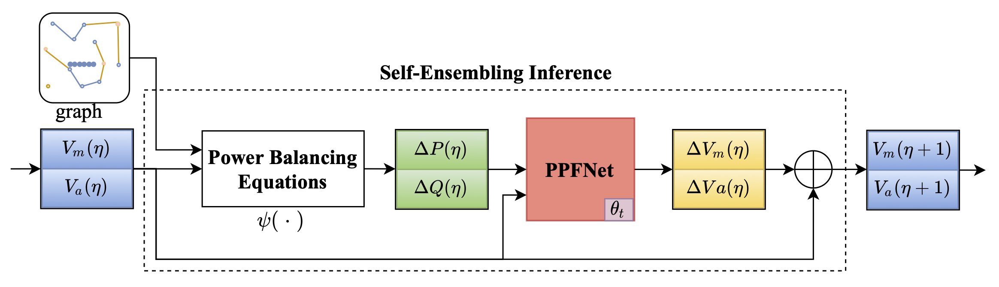
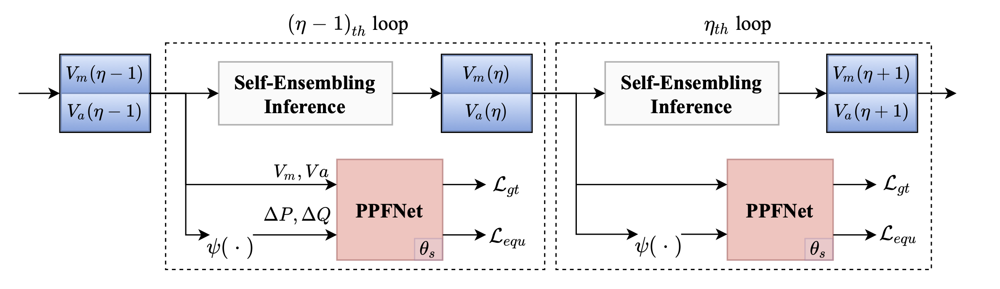
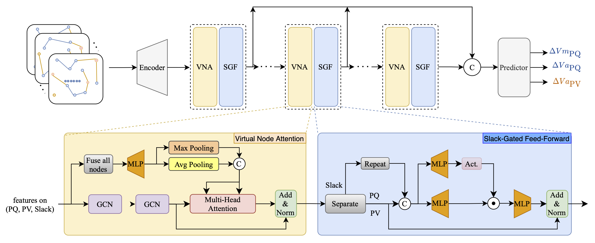

# SenseFlow

## [CIKM 2026] A Physics-Informed and Self-Ensembling Iterative Framework for Power Flow Estimation

Zhen Zhao · Wenqi Huang · Zicheng Wang · Jiaxuan Hou · Peng Li · Lei Bai

[](https://arxiv.org/abs/2505.12302)
[](https://github.com/ZhenZHAO/SenseFlow)

------

## Introduction

**SenseFlow** is a physics-informed and self-ensembling iterative framework for high-accuracy **power flow estimation**.

Unlike conventional data-driven power flow models that mainly treat the grid as a generic graph, SenseFlow explicitly considers two important characteristics of power systems:

- **Sparse grid connectivity**, where local disturbances may have system-wide effects.
- **The unique Slack bus**, which provides the reference for voltage phase angles.

SenseFlow consists of two key components:

- **FlowNet**, a physics-informed graph neural network equipped with **Virtual Node Attention (VNA)** and **Slack-Gated Feed-Forward (SGF)** modules.
- **SeIter**, a self-ensembling iterative estimation strategy that progressively refines voltage magnitude and phase-angle predictions.

SenseFlow achieves high-precision power flow estimation across IEEE 39-Bus, 118-Bus, and 300-Bus systems, while also showing robustness to incomplete inputs.

------

## Method

### Self-Ensembling Iterative Estimation

<p align="center">   </p>

Instead of estimating the final power-flow state in a single forward pass, SenseFlow progressively refines the prediction through multiple iterations.

At each iteration, FlowNet predicts the changes of voltage magnitude and phase angle based on the current system state and power imbalance. A self-ensembling teacher model, maintained using an **Exponential Moving Average (EMA)** of model parameters, generates stable predictions for the next iteration.

This iterative procedure gradually reduces the power imbalance and improves estimation accuracy.

The default implementation uses **8 iterative loops**, providing a good balance between estimation accuracy and computational cost.

### Physics-Informed Power Flow Network

<p align="center">  </p>

The backbone of SenseFlow is **FlowNet**, which is designed specifically for the structural characteristics of electrical power systems.

FlowNet contains two major modules:

**Virtual Node Attention**：Power grids are highly sparse graphs, while a disturbance at one bus can influence the entire system. Virtual Node Attention (VNA) aggregates information from all PQ, PV, and Slack buses into a virtual global representation and redistributes system-level information to individual buses through cross-attention. This enables efficient **global-local information interaction** without modifying the original grid topology.

**Slack-Gated Feed-Forward**: The Slack bus plays a unique role in power-flow analysis because its voltage angle provides the global phase reference. Slack-Gated Feed-Forward (SGF) explicitly injects Slack-bus information into PQ and PV node representations using a gated feed-forward mechanism.This strengthens the influence of the Slack bus while preserving the local characteristics of individual buses.


------

## Citation

If you find SenseFlow useful in your research, please consider citing our work:

```bibtex
@article{zhao2025senseflow,
  title   = {SenseFlow: A Physics-Informed and Self-Ensembling Iterative Framework for Power Flow Estimation},
  author  = {Zhao, Zhen and Huang, Wenqi and Wang, Zicheng and Hou, Jiaxuan and Li, Peng and Bai, Lei},
  journal = {arXiv preprint arXiv:2505.12302},
  year    = {2025}
}
```

------

## Acknowledgement

SenseFlow is developed for exploring **physics-informed learning and data-driven power flow estimation** in increasingly complex power systems.

We hope this repository can facilitate further research on AI for power systems, including power-flow estimation, system sensing, contingency analysis, and data-driven grid operation.
